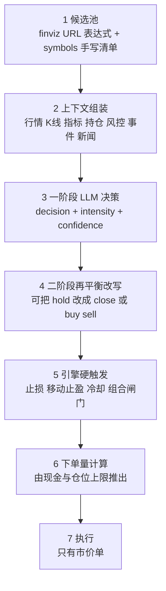

# AI 策略的端到端流程

「写提示词 + 配选股源，让大模型选股」只覆盖了流程的前三段。**真正决定最终成交的是后面四段，而它们的行为经常和提示词写的不一样。** 这份文档把七段串起来，标明每段你能控制什么、控制不了什么。

细节与证据链散在 `trade-copilot-mcp.md` 和 `reviews/` 各篇里，本文只做地图，遇到分歧以本文的 `last_verified` 日期为准。

## 全流程



## 逐段说明

### 1. 候选池

两个来源可以并用：**`finviz_url`**（支持多条，换行分隔，每条独立执行后合并）与 **`symbols[]`**（手写清单）。已持仓标的始终在可交易范围内，即使跌出候选池。

你控制筛选条件与排序。你不控制的是：平台从每条 URL 的命中结果里取多少只（`get_strategy_screener_pool` 观察到池子规模在 19–27 之间，而单条 URL 的命中可以有 53 只），以及刷新时机——**`get_strategy_screener_pool` 返回的是缓存快照，`updated_at` 每轮分析才动一次**，所以改完 URL 立刻去查池子看不到变化。

一个已知陷阱：**finviz 是股票筛选器，永远不返回 ETF**。想让策略碰 ETF 只能写进 `symbols[]`。

另一个陷阱是滚动窗口动量门槛的固有缺陷：`ta_perf_4w10o` 这类条件会在板块暴跌后的第一个月系统性排除该板块，因为回看窗口横跨崩盘。对策见 `reviews/2026-08-14-degen-pool-fix.md`。

### 2. 上下文组装

平台把这些拼成一次 AI 请求（`prompt_version` 实测 v6）：风控参数、当前持仓、当前时间（含距收盘分钟数与报价快照时延）、即将到来的关键事件（FOMC/CPI/非农，带影响级别与天数）、当前账户状态（现金占比与调仓建议）、每个标的的实时行情 + 各周期 K 线 + 技术指标、相关新闻（近 30 天，带情感与中文摘要）。

你通过 `market_data` 控制喂进去哪些数据（K 线周期与根数、指标参数、`realtime`、`include_news`、`include_market_context`、`fundamentals`）和 `include_positions`。

**已确认的坑：`market_data` 里配置 1h 周期会导致策略完全不运行**——不是决策质量下降，是一条决策都产生不了。详见 `trade-copilot-mcp.md`。

### 3. 一阶段 LLM 决策

这是提示词唯一真正生效的地方。输出 schema 只有五个字段：

```json
[{"symbol":"XPEV","decision":"open","confidence":0.95,
  "intensity":"heavy","summary":"..."}]
```

- `decision`：`open` 开仓 / `buy` 加仓 / `sell` 减仓 / `close` 平仓 / `hold` 持有 / `wait` 观望
- `intensity`：观察到 `light` / `moderate` / `heavy`。注意提示词里常写「medium」而平台记录的是「moderate」，两者是否等价未验证
- `confidence`：这个数字比 `summary` 里的文字重要得多，见第 4 段

**没有股数、没有价格、不能挂限价单。** 提示词里写「每格买 30 股」「在 11.28 挂买单」只会进入 `summary` 自由文本，执行引擎不解析。这是网格类策略无法用 AI 策略接口表达的根本原因。

### 4. 二阶段再平衡改写

**这一段是最容易被忽略、也最容易让人误判策略行为的地方。** 系统会在一阶段之后改写 LLM 的决策，改写记录的 `model` 字段是 `system:rebalance`，`summary` 里带「[rebalance 改写]」前缀和原决策 id。

观察到两种改写：

**（a）驱逐换仓** —— 满仓时把最弱持仓的 `hold` 改写成 `close`，给置信度更高的新候选腾位置。判据是**新候选置信度 − 最弱持仓置信度 > 0.10**。

**（b）仓位修正** —— 把仓位修到 `max_position_pct` 上限，超了就改写成 `sell`，没到就改写成 `buy`。改写理由的原文例如「当前仓位 16.4% 超过单标上限 16%，减仓至上限以内」「加仓至单标仓位上限，优化现金利用」。

第二种会产生很多无意义的碎单：8/13 均值回归为了把三个仓位从 15.1%/15.6%/15.4% 修到 14.9%，卖了 4 股、付 1.10 手续费、亏 11.55。

**提示词对这一段完全无效。** 写「不要频繁换仓」没用，因为一阶段本来输出的就是 `hold`，是系统改的。唯一能影响它的杠杆是数字型字段：

- `confidence`——抬高在手持仓的置信度下限，可以掐断驱逐换仓（8/06 给赌狗加了「持仓 confidence 不得低于 0.80」，8/11–8/13 观察到持仓评分稳定在 0.80–0.90，驱逐确实不再发生）
- `max_position_pct` / `target_cash_pct`——决定仓位修正的目标值

还有一个需要注意的冲突：赌狗的提示词写着「剩下约 20% 是常备现金缓冲，这层缓冲是刻意留的」，而再平衡器的改写理由写着「优化现金利用」并往 `target_cash_pct` 的方向压。**两者直接矛盾，而再平衡器在后面，它说了算。**

这一段还有一个运行风险：它是独立的一次 AI 调用，如果供应商的最大输出长度不够、推理链把预算吃光，这次调用会返回空（`finish_reason: length`），本轮再平衡直接白跑。见 `reviews/2026-08-12-ai-truncation-and-recurring-warnings.md`。

### 5. 引擎硬触发

这些**绕不过去**，也不需要 LLM 配合，`model` 字段能看出来源：

| 来源 | 触发条件 | 实测样例 |
| --- | --- | --- |
| `system:hard-stop-loss` | 浮亏超过 `stop_loss_pct` | 8/13 COHR 浮亏 −5.39% 超过 −5% 线，强制平仓 |
| `system:trailing-stop` | 峰值浮盈达 `trailing_profit_activation_pct` 后回撤超 `trailing_profit_lock_drawdown_pct` | 8/12 AXTI 峰值 +13.48%、回落到 +7.23%、回撤 6.25pp > 5pp，锁定 +1,240 |
| 冷却期 | `trade_cooldown_minutes` 同标的、`reverse_cooldown_minutes` 反向 | 必须**明显长于** `analysis_interval`，否则形同不存在 |
| 三道组合闸门 | `total_drawdown_stop_pct` / `stop_loss_frequency_limit` / `portfolio_cooldown_minutes` | 峰值回撤转 close_only、止损频率闸、止损后全局冷却 |
| `trading_mode` | `normal` / `open_only` / `close_only` | 这是最可靠的机制约束，比任何百分比都硬 |

**注意一个反直觉的事实**：`stop_loss_pct` 同时有两个作用面——它既以「软参考」的措辞进入 AI 请求让 LLM 参考（原文「浮亏接近此值时综合趋势判断，不要因单日波动伪触发就提前 close」），**也被引擎当硬触发机械执行**。两者并存，不是二选一。

所以把它设成 50 的效果不是「关掉了硬止损」，而是「把硬止损的触发线设到了实际到不了的位置」。对网格和 `open_only` 策略这是有意为之，对需要止损的策略要设成真实可达的值（均值回归设 5、赌狗设 8，两者的硬止损都真的触发过）。

### 6. 下单量计算

**这一段完全不受提示词和 `intensity` 影响。** 公式：

```
下单金额 = min( 可用现金 × (1 − cash_reserve_pct),
                max_position_pct × 策略总资产 )
```

`intensity` 不参与。三次独立观察都打满了 `max_position_pct` 上限，与 intensity 无关：

| 日期 | 标的 | intensity | 上限 | 实际成交 |
| --- | --- | --- | --- | --- |
| 7/30 | VOO | light | 20% = 20,000 | 19,618（29 股） |
| 8/11 | AXTI | moderate | 16% ≈ 17,406 | 17,315（237 股） |
| 8/13 | ACHR | light | 16% ≈ 17,656 | 17,858（2,668 股） |

这解释了两类反复出现的问题：

- **一次性打满**：`max_position_pct` 设得比策略意图大，第一笔就把配额用光。长持 VOO 的定投设计因此只活了一个上午
- **网格振荡**：单笔下单量远大于提示词的判定死区时，每次调整必然越过死区落到另一侧，下一轮必然反向。XPEV 的单笔约 1,200 股是死区 150 股的 8 倍，于是每天买卖四五次、价格在 0.4% 区间内来回，纯亏摩擦

想控制单笔大小只能调 `max_position_pct` 和 `cash_reserve_pct`，没有别的旋钮。

`target_cash_pct` 是反向施压的：设为 0 时平台会在 AI 请求里主动写「现金占比已超过目标 0%，应通过换仓消化」，等于催 LLM 把现金用光。

### 7. 执行

只有**市价单**（`order_type` 观察到的全部是 `market`）。实测成本：

| 项 | 实测值 | 样本 |
| --- | --- | --- |
| 手续费 | **$0.0035/股**，按股计费无固定部分 | 6,882 股收 24.09 |
| 单边滑点 | **约 0.55%** | 分析价 13.005 → 成交 13.0765，仅 1 次测量 |
| 分析到成交延迟 | 约 2.5 分钟 | 同上 |

**滑点是真正的成本，佣金不是。** 往返约 1.1% 的滑点意味着任何目标利润低于 1.5% 的策略在结构上就很难成立——这是价格行为日内策略那套 0.4%/0.8%/1.2% 目标位的根本问题。

另外 `analysis_interval` 只是期望值，**实测调度频率明显低于配置**（30 分钟间隔的策略在 6.5 小时时段里只运行过 2 次），不要假设会严格按配置执行。

## 想改某个行为，该动哪个旋钮

这张表是本文最实用的部分。

| 想改变的行为 | 有效的旋钮 | 无效的做法 |
| --- | --- | --- |
| 买什么标的 | `finviz_url` 条件与排序、`symbols[]` | —— |
| 让策略碰 ETF | 只能写 `symbols[]` | finviz URL（股票筛选器不返回 ETF） |
| 选股逻辑与主题判断 | `system_prompt` | —— |
| 换用别的模型 | `ai_provider_id`（先用 `list_ai_providers` 把名称映射成 uuid） | —— |
| 模型的最大输出长度 / thinking 开关 / temperature | **只能在平台 UI 改**，无 MCP 写工具 | —— |
| 单笔下单多大 | `max_position_pct`、`cash_reserve_pct` | 提示词写股数、`intensity` |
| 挂限价单 / 指定价格 | 做不到 | 提示词写价位 |
| 持仓数量上限 | `max_positions` | —— |
| 减少被强制换仓 | 提高在手持仓的 `confidence` 下限（写进提示词的评分纪律） | 提示词写「不要频繁换仓」 |
| 减少仓位微调碎单 | 把 `max_position_pct` 设得比目标仓位高一些，留出波动余量 | —— |
| 保留现金缓冲 | `target_cash_pct`、`cash_reserve_pct` | 提示词写「刻意留 20% 缓冲」（会被再平衡器的「优化现金利用」推翻） |
| 真正禁止卖出 | `trading_mode: open_only` | `stop_loss_pct` 设很大 |
| 真正的止损 | `stop_loss_pct` 设成可达值（会触发 `system:hard-stop-loss`） | —— |
| 禁止某标的在止损后回头买 | **当前无解**，筛选器无记忆、LLM 上下文里也没有止损历史 | 提示词写「5 个交易日内不得再买」 |
| 降低换手 | 拉长 `analysis_interval`、把冷却期设成明显长于间隔 | 提示词写「快进快出但避免打脸」 |
| 收盘前清仓 | `allow_overnight: false` + `close_before_minutes` | 提示词写「收盘前必须清空」（配置对了也曾未生效，见 8/14 复盘） |

## 三条最容易误判的地方

**一、提示词只管第 3 段。** 第 4–7 段（再平衡、引擎触发、下单量、执行）全部由配置字段和引擎逻辑决定，写文字不起作用。判断「某个行为该怎么改」之前，先确定它发生在哪一段。

**二、`summary` 里的话不算承诺，`confidence` 才是。** LLM 写「继续持有」而再平衡器把它改写成 `close` 是常态。复盘时要看 `model` 字段区分是谁做的决定。

**三、`execution_status` 的 `skipped` 不等于策略判断错。** 它可能是坑位满了、冷却期挡住了、或者被闸门拦了。统计决策质量时 `filled` 和 `skipped` 不能混算，混算得到的是「LLM 嘴上说买的能力」而不是策略赚钱能力。

## 免责声明

本文档为技术研究记录，不构成投资建议。文中所有机制均来自有限的实盘观察（截至 2026-08-14 共 11 个交易日、6 个策略），滑点等成本只有单次测量，平台版本迭代也可能改变行为。发现与本文不符的现象时以实测为准，并更新本文。
